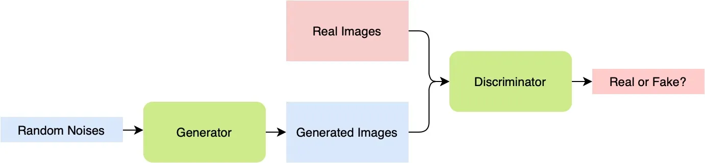

## Table of Contents
- [Introduction](#Introduction)
- [Medical Image Segmentation with EfficientNet and MONAI](#medical-image-segmentation-with-efficientnet-and-monai)
  - [Prerequisites](#prerequisites)
  - [Dataset](#dataset)
  - [Data Preparation](#data-preparation)
  - [Training](#training)
  - [Inference](#inference)
- [Generative Adversarial Network (GAN)](#generative-adversarial-network-gan)
  - [GAN Architecture](#gan-architecture)
  - [Model Initialization](#model-initialization)
  - [Optimizers](#optimizers)
  - [Loss Function](#loss-function)
  - [Training Loop](#training-loop)
  - [Requirements](#requirements)

# Introduction

This repository contains two scripts for different tasks in deep learning: one for medical image segmentation using the EfficientNet architecture with MONAI, and another for training a Generative Adversarial Network (GAN) using PyTorch. Each script serves a specific purpose and is explained in detail below.

The first script, `train.py`, focuses on training a medical image segmentation model using the EfficientNet architecture and the MONAI library. The model is designed for binary segmentation and aims to identify specific structures or regions of interest in medical images. The script includes data preparation, model training, and inference steps.

The second script, `trainGAN.py`, is dedicated to training a GAN. It comprises the training loop for both the Generator (netG) and the Discriminator (netD). The script provides an introduction to the GAN architecture, model initialization, optimizers, and the training loop. It's designed for users interested in training GANs from scratch.

Now, let's dive into the details of each script in the following sections:

# Medical Image Segmentation with EfficientNet and MONAI

This repository contains code for training a medical image segmentation model using the EfficientNet architecture and the MONAI library. The model is trained for binary segmentation, with the goal of segmenting specific structures or regions of interest in medical images.

## Prerequisites

Before you begin, make sure you have the following dependencies installed:

- Python 3.x
- PyTorch
- MONAI
- OpenCV
- Other required libraries (dependencies listed in the code)

You can install MONAI and its dependencies using pip:

```
pip install monai

```

## Dataset

The dataset used for training and validation is expected to be provided as a CSV file containing information about image file paths and corresponding labels. Ensure that you have the dataset in the appropriate format and specify the path to the CSV file in the script.
Usage

## Data Preparation

Before running the training script, you should collect your own medical image dataset. To generate the required CSV files for training and testing, you can use the data_preparation.py script provided in this repository:

```
python data_preparation.py

```

This script will generate dataset/dataset_train.csv and dataset/dataset_test.csv based on your collected data.

Clone the repository to your local machine:

```

git clone https://github.com/huynhhoc/dlMONAIexample.git
cd dlMONAIexample

```
## Training

You can start training the segmentation model by running the provided script:

```
python train.py

```

The script performs the following steps:

    Data preprocessing and augmentation using MONAI transforms.
    Model architecture setup (EfficientNet with binary classification).
    Loss function and evaluation metric definition (Dice Loss and Dice Metric).
    Model training with Adam optimizer.
    Validation and best model checkpointing based on the Dice score.

You can customize various training settings in the script, such as batch size, learning rate, and the number of epochs.

## Inference

Once the model is trained, you can perform inference on new medical images. Modify the script as needed for your specific inference requirements.

# Generative Adversarial Network (GAN)
This script is used to train a Generative Adversarial Network (GAN) using PyTorch. It includes the training loop for both the Generator (netG) and the Discriminator (netD).

```
   trainGAN.py

```

## GAN Architecture

The GAN architecture consists of two main components: the Generator and the Discriminator.



### Generator (netG)

- The Generator is responsible for creating synthetic images that are intended to resemble real data.

- It is initialized using the `Generator` class, and its weights are initialized using the `init_weights` function.

- The Generator consists of several layers, including ConvTranspose2d layers for upsampling and BatchNorm2d layers for normalization. The final layer uses the Tanh activation function to produce image outputs.

### Discriminator (netD)

- The Discriminator is responsible for distinguishing between real and fake images.

- It is initialized using the `Discriminator` class, and its weights are initialized using the `init_weights` function.

- The Discriminator also consists of Conv2d layers with LeakyReLU activation functions.

## Model Initialization

- `netG`: The Generator model is created using the `Generator` class and is moved to the specified device.

- `netD`: The Discriminator model is created using the `Discriminator` class and is also moved to the specified device.

## Optimizers

- `opt_D`: An Adam optimizer is set up for the Discriminator model (`netD`) with a learning rate of 0.0002 and betas (0.5, 0.999).

- `opt_G`: An Adam optimizer is set up for the Generator model (`netG`) with a learning rate of 0.0002 and betas (0.5, 0.999).

## Loss Function

- `loss`: The loss function is set to DiceLoss with sigmoid activation, which measures the similarity between predicted and target values.

## Training Loop

The training loop follows the standard GAN training procedure and iterates over the batches of data provided by the `train_loader`.

...

The training loop iterates over the batches of data provided by the `train_loader`. For each batch, it follows the standard GAN training procedure:

1. Real Images:
   - Real images are reshaped to the expected shape (assuming inputs have a shape of [batch_size, channels, height, width]).
   - The gradient is cleared.
   - The Discriminator model (`netD`) computes its output for real images.
   - The loss for real images is calculated and gradients are computed.
   
2. Fake Images:
   - Fake images are generated by passing random noise through the Generator model (`netG`).
   - The Discriminator model (`netD`) computes its output for fake images.
   - The loss for fake images is calculated and gradients are computed.
   
3. Total Discriminator Error:
   - The total error for the Discriminator is calculated as the sum of the losses for real and fake images.

4. Discriminator Update:
   - The weights of the Discriminator are updated using the `opt_D` optimizer.

5. Generator Update:
   - The gradient for the Generator is cleared.
   - The Discriminator model (`netD`) computes its output for the fake images generated by the Generator.
   - The loss for the Generator is calculated and gradients are computed.
   - The weights of the Generator are updated using the `opt_G` optimizer.

Please note that during the Generator update, the `loss_gen.backward()` is commented out since you should only call `backward()` once for each loss during the backpropagation process.

The training loop continues for multiple epochs, and you can monitor the training progress and loss values.

## Requirements

- PyTorch (make sure you have PyTorch and required dependencies installed)

Feel free to customize this script and the architecture details to match your specific dataset and GAN model. The provided information gives an overview of the GAN architecture used in this script.
